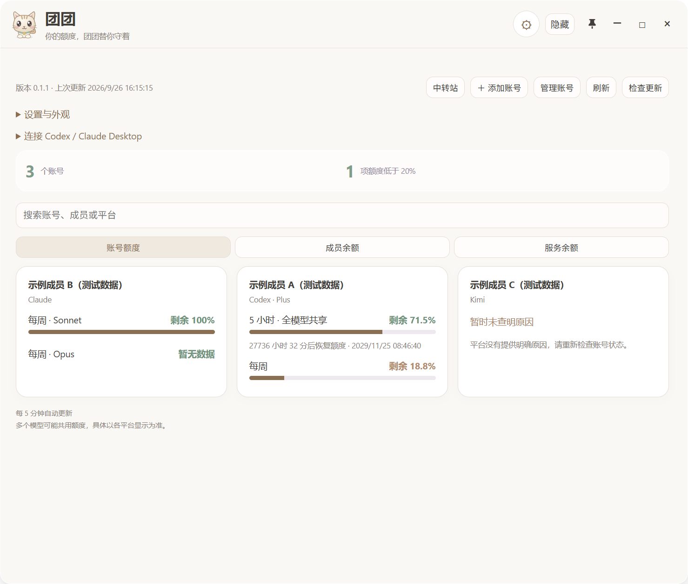

<div align="center">


# 团团 · Quota Pet

一个轻巧的 Windows AI 额度桌面伴侣。

[下载 Windows 版](https://download.yulitongxing.com) · [版本记录](https://github.com/Destined-at-Dawn/quota-pet/releases) · [反馈问题](https://github.com/Destined-at-Dawn/quota-pet/issues)


</div>



## 能做什么

- 桌面圆球、悬浮额度面板和系统托盘；拖动圆球贴靠屏幕左右边缘。
- 查看已有号池服务返回的账号额度、重置时间、成员及渠道数据；未知额度保持未知。
- **Ctrl+Shift+X** 快速唤起，快捷键可自定义；支持窗口置顶、主题和三种界面语言。
- 可配置自动刷新间隔，显示低额度提醒。
- 在 App 内检查官网版本：显示当前版本、最新版本和检查结果；仅在用户点击下载时打开下载链接。
- 通过单独安装的 CC Switch，把已有网关 API Key 配置给 Codex 或 Claude Desktop。

## 下载与运行

1. 在[下载页](https://download.yulitongxing.com)下载 Windows x64 ZIP。
2. **完整解压**到一个固定文件夹，再运行 `QuotaPet.exe`；不需要安装 Node.js。
3. 额度数据需要在 App 中登录现有号池服务，并拥有对应访问权限。
4. 点击窗口关闭按钮可转入后台；彻底退出请使用系统托盘菜单。

此版本是便携包，没有自动安装或静默替换程序。检查更新会在启动约 8 秒后执行，并每 6 小时复查。正在运行旧版时，请先从托盘退出再打开新版。

## 数据与当前功能边界

当前构建连接 `pool.yulitongxing.com` 与 `console.yulitongxing.com`。它是已有服务的桌面客户端，**仓库不包含服务端、公共演示账号或内置 API Key**。

登录由用户在服务页面完成。登录信息保存在独立的 Electron 用户目录中，加密备份使用 Electron `safeStorage`；额度快照和偏好保存在本机。发布源码与安装包不携带开发者会话、个人账号、真实额度记录或浏览器数据。

“导入个人订阅 → 自动签发只使用本人账号的 Key”仍在开发，不属于此版本已完成的功能。CC Switch 入口是已有 Key 的配置引导；实际导入与切换需在 CC Switch 中确认。额度展示精度以服务端提供的数据为准。

## 本地开发

需要 Windows、Node.js 22 或更新版本及 npm。

```bash
npm ci
npm test
npm run audit
npm start
```

使用模拟数据进行 Electron 界面验证：

```bash
npm run smoke
```

构建和打包：

```bash
npm run build
npm run package
```

构建输出为 `dist/QuotaPet/`；发布 ZIP 与校验文件位于 `artifacts/`。构建目录必须全新，打包脚本会拒绝包含登录文件、运行日志或个人缓存的目录。

## 项目结构

| 文件 | 作用 |
|---|---|
| `main.js` / `preload.js` | Electron 窗口、托盘、登录会话与 IPC |
| `renderer.js` / `model.js` | 额度界面与数据归一化 |
| `preferences.cjs` / `hotkey.cjs` | 偏好与全局快捷键 |
| `update-check.cjs` | 官网发布清单与版本比较 |
| `client-setup.cjs` | CC Switch 协议集成 |
| `privacy-audit.cjs` | 源码及便携包发布检查 |

## 开源与致谢

采用 **Apache-2.0** 许可证。项目参考了 [PoggetCore](https://github.com/EnderMo/PoggetCore) / [VinaUI](https://github.com/EnderMo/VinaUI) 的桌面交互思路；Quota Pet 是独立编写的 Electron 应用，不是 Pogget 的改名版本。

完整第三方说明见 [THIRD_PARTY_NOTICES.md](THIRD_PARTY_NOTICES.md)。提交问题时请先遮盖邮箱、Key 和额度截图中的个人信息。
